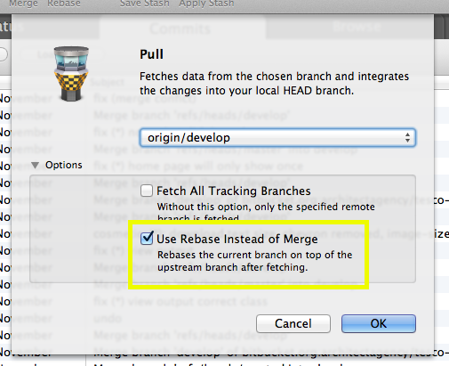

Working with Git
================

1. [Pulling](#pulling)
1. [Assume Unchanged-ing](#assume-unchanged)
1. [Ignore](#ignore)

Assume Unchanged
----------------

If you have to put any details specific to your local environment or machine or you into a file in your project, you can tell git to ignore any future changes to that file. This is different to a .gitignore, which is for when you don't want to track that a file ever exists.

```bash
git update-index --assume-unchanged path/to/file.m
```

And you can undo this with
```bash
git update-index --assume-unchanged path/to/file.m
```

Pulling
-------

If you’re on the **same** branch as the branch you’re merging in from on the remote, for example you’re merging `origin/develop` into your local `develop` branch, you should use merge with rebase.

Tower:


**NB** This is different to a rebase, do not use Rebase, use Merge with Rebase (confusing I know).

Command line:
```bash
git pull --rebase
```

Ignore
------

The following files should nearly always be ignored:

* npm-debug.log
* composer.phar
* .DS_Store
* .sass-cache
* node_modules
* /vendor
